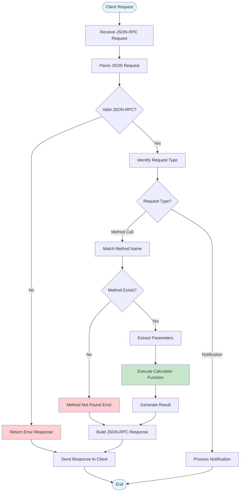

# JSON-RPC Calculator Application Flow

## Overview Diagram

## Detailed Flow Steps

### 1. **Receive Request**
The server receives an incoming JSON-RPC request from the client containing method name and parameters.

### 2. **Parse Request**
Parse the JSON payload to extract the request structure and validate it against JSON-RPC 2.0 specification.

### 3. **Identify Request Type**
Determine if the request is:
- A method call (expects a response)
- A notification (no response expected)
- A batch request (multiple operations)

### 4. **Match Method**
Map the requested method name to the corresponding calculator function:
- `add` → Addition function
- `subtract` → Subtraction function
- `multiply` → Multiplication function
- `divide` → Division function

### 5. **Execute Function**
Call the matched calculator function with the provided parameters and handle any computational errors (e.g., division by zero).

### 6. **Send Response**
Format and return the JSON-RPC response with either:
- **Success**: Result with matching request ID
- **Error**: Error object with code and message